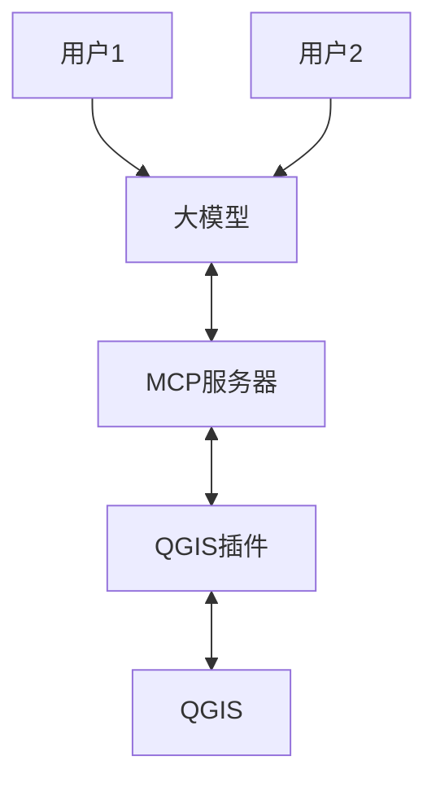

[TOC]


## 写在前面

近期MCP[^1]很火哎，不断涌现出各种各样的工具。例如利用MCP进行代码补全/生成，浏览器控制，地图导航，寻址，网络搜索等[^2]，一切都是基于自然语言实现的自动化。当然除了上述，我最关心的还是它在GIS领域开出了什么花，一番搜索之下发现当前开源社区已经存在了一款功能强大的插件——[qgis_mcp](https://github.com/jjsantos01/qgis_mcp)。

代码仓库地址：https://github.com/jjsantos01/qgis_mcp

在我搜索过程中，几个头部的国内外传统GIS公司，都还没有发布正式的MCP工具，如ESRI，Mapinfo和SuperMap（或许已经在开发中只是仍未成熟等待发布，又或许还没有，又或许是我没找到）。相较于开源的QGIS，任何人，如果你有能力，都可以给它加上你想要的功能，这一点我认为非常棒，这使得它在某些功能/特性方面推进的更快，虽然效果不一定比闭源好。

尝试使用这个MCP工具，看看效果如何。

## 如何安装

尽管仓库作者写的安装说明已经很清晰明了，但由于描述语言是英文，对中文母语者可能不太友好，所以在这里记录自己的完整安装过程。

这个插件系统包含两个组件，一个是QGIS插件，另一个是MCP服务器。除此之外，还需注册有一个能正常使用的大模型，可以使用在线的[Claude](https://claude.ai/)或者[DeepSeek](https://www.deepseek.com/)等模型提供商。

这些是运行的环境要求：

- 安装有QGIS版本 3.X
- 安装有Claude desktop（如果使用Claude需要）
- 安装有5ire（如果使用DeepSeek，OpenAI等其它模型需要）
- 安装有Python 解释器版本为3.10 或更新
- 安装有Python包管理器uv


### 注册模型服务

一步步来，首先最重要的是模型提供商的账户。Deepseek等直接到官网注册即可，而Claude以及OpenAI等并未在中国大陆及港澳台提供模型服务，所以注册步骤会有点曲折，网上也有许多相关资料攻略，这里就不再延伸展开。


### 安装uv

用它来运行MCP 服务器本体，macOS用户可使用homebrew安装，执行如下命令：

```bash
brew install uv
```

windows用户可使用powershell安装，执行如下命令：

```bash
powershell -ExecutionPolicy ByPass -c "irm https://astral.sh/uv/install.ps1 | iex"
```

如若通过上述命令无法安装，则直接上官网下载。

### 安装QGIS插件以及MCP服务器

#### 安装QGIS插件

下载仓库源码，使用Git或者直接以zip格式下载后解压。

打开QGIS，依次点击Settings` -> `User profiles` -> `Open active profile folder，进入目录之后，再进入 python -> plugin目录，将上一步下载好的插件文件夹里的`qgis_mcp_plugin`复制到`plugin`，接着重启QGIS。


再次打开，进入 `Plugins` -> `Mange Plugins`，选择`Installed`，勾选启用插件。


接着你的软件界面会出现如下窗口，点击Start Server，插件就安装好了。


#### 安装MCP服务器

如果用的是Claude则安装该客户端，否则跳过。

先到[Claude](https://claude.ai/download)官网按照操作系统下载客户端，安装后运行。

进入设置 Settings -> Developer -> Edit Concig


编写如下，其中只需要修改一项，然后重启Claude客户端。

```json
{
    "mcpServers": {
        "qgis": {
            "command": "uv",
            "args": [
                "--directory",
              "/这里是填写下载仓库代码后打开的目录/qgis_mcp/src/qgis_mcp",
                "run",
                "qgis_mcp_server.py"
            ]
        }

    }
}
```


打开Claude对话框，聊天框底部有个小锤子，就代表安装成功了（如果仅安装了QGIS MCP一个服务的话，不放心可以点击小锤子，查看是否有QGIS相关服务）


如果使用DeepSeek或者OpenAI等，则安装该客户端。

打开[5ire](https://github.com/nanbingxyz/5ire/releases)发行页面，根据操作系统选择合适版本下载后安装，打开设置页面。


先设置大模型


接着设置MCP服务


名称，标识什么的随便填写，但是命令必须如以下格式一致。


## 使用案例

这里使用Claude客户端来测试，而使用5ire的话流程是一样的。

### 渲染地图风格

先来测试一下，我预先往地图画布中添加一个矢量图层，然后按照字段让它分层设色。


接着提问它：

```
当前图层中，帮我按照“地级码”对图层进行分组，并设置不同颜色风格
```


### 属性统计

可以看到它正确理解了我的指令并完成相关工作。然后我又让它统计即每个要素（即图中的区县）的面积，并生成统计表格和图表。

```
帮我统计当前矢量图层中，每一个要素的面积，并制作一份柱状图统计表格，我使用的是macOS，桌面路径为/Users/wsh/Desktop。
```


执行结果有一份excel和下面这张图片。我猜测它使用Matplotlib来绘制，因为没有正确设置字体，所以中文标签变成口口口。


需要再点拨一下，将提示词修改为如下，再次执行，图表就显示正常了。

```
帮我计算所有要素的面积，并生成一个柱状图，图表标签是地名，地名字段的名称为“地名”。图表标签是中文，所以你需要正确设置绘制指令以至显示，最后将结果保存在我的桌面上。
```


### NDVI计算

难度提升，让它计算Landsat 5 多波段遥感影像的NDVI指数，

```
在路径为/Users/wsh/Desktop/data的文件夹，里面的子文件夹是一期Ladsat 5卫星遥感影像，包含多个波段。根据这些影像，请帮我计算NDVI指数，并显示在地图上
```

下图的NDVI计算结果是错误的，不知道是不是因为我没有提供足够的信息，调整了好几次提示词，都没有成功。


下图是我手动计算的结果。


### 获取地理位置以及显示

我让它帮忙查看杭州所有大学在地图上的分布。

```
帮我获取杭州所有大学的名单及其经纬度坐标，并显示在地图上
```

大模型获取到了坐标信息，但是并不能将其渲染到QGIS地图画布中，因为该MCP工具暂时还不支持根据文本坐标创建点图层。不过它令人惊喜的一点是，在MCP不支持自动生成点图层的情况下，它通过生成一份HTML网页这种“曲线救国”的方式完成了我的需求，用浏览器打开，可以进行简单的交互查看。


## 背后的原理

先暂时抛开那些专业且复杂的名词，定义，简单了解下大模型，MCP服务器，QGIS插件，QGIS四者，它们之间如何互相协同完成需求[^3]。




大模型作为总指挥，它理解人类语言将需求分解，然后间接控制QGIS执行一系列动作来完成需求，而MCP服务器和QGIS插件可以看作是控制的手段（类似计算机里的中间件）。它通过MCP协议与MCP服务器交互。

MCP服务器作为工具箱的角色，它告诉大模型它内部实现了什么服务，通过它可以执行哪些功能，执行功能的时候需要提供哪些输入数据等一系列上下文信息。

QGIS插件则是MCP服务器所描述的功能的实现者。通俗点说就是MCP服务器画大饼，然后它来干活。它与服务器一般采用WebAPI来通信。

最后是QGIS，其实它才是真正的打工人，因为QGIS插件只是调用了它的API来完成具体工作。


## 写在后面

目前MCP在GIS领域的应用尚在起步阶段，功能还不是很丰富，未来应该会有越来越多服务集成进来，特别是基于位置的服务（LBS）。

附带一些小吐槽，首先是整个MCP体系太繁琐了，安装这又那的，而且每一个MCP服务都是独立的，也就是说A电脑安装后无法与B电脑共享（未来会不会出现那种MCPServerHub）。

其次MCP服务的运行环境是python或者node，如果安装多个服务是否会造成资源浪费，毕竟不是每一个服务都时刻在用，能不能复用一套环境呢。

最后这一条仅针对GIS，使用它来处理地理数据有泄密风险。因为GIS特殊的行业性质，导致许多数据涉密，不能使用互联网上公开的大模型服务来处理，除非是个人或者企业内部部署，光这一条我觉得就已经将一半的人拦在门外。


## 参考

[^1]:https://www.claudemcp.com/
[^2]:https://www.bilibili.com/video/BV1MjZ5YrESn/?spm_id_from=333.1007.top_right_bar_window_dynamic.content.click&vd_source=10d0f86227f3c318f8237345caac47c8
[^3]:https://www.cnblogs.com/lwp-nicol/p/18793956